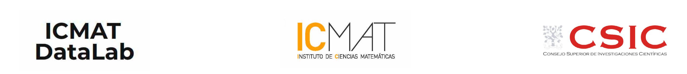

This website displays the content of the different activities carried out by the Datalab-ICMAT during the Bayesian Machine Learning Year, which corresponds to the final year activities of the AXA-ICMAT Chair. 

Besides, you can find some of the software implemented during our research in several fields, such as cybersecurity, drug design, and medicine. Check [here](https://datalab.icmat.es/) for more information about all group activities.

## Courses

* Introduction to Machine Learning ([Info and Registration](https://datalab.icmat.es/bayesian-year/iml/))
* Bayesian Data Science ([Info and Registration](https://datalab.icmat.es/bayesian-year/bds/))

## Reading group

* Causal Inference and Machine Learning ([Info and Registration](https://datalab.icmat.es/bayesian-year/ciml/))

The previous activities are supported by the AXA-ICMAT Chair in Adversarial Risk Analysis, the Severo Ochoa program at ICMAT, the Spanish Royal Academy of Sciences, the European Office of Aerospace Research and Defense and the CSIC-Aihub connection, among others.

 

